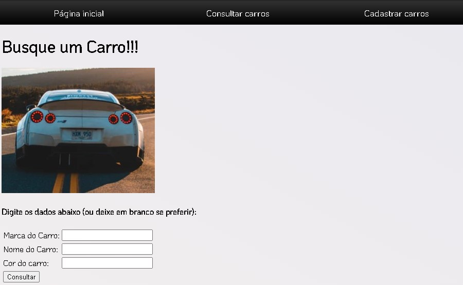
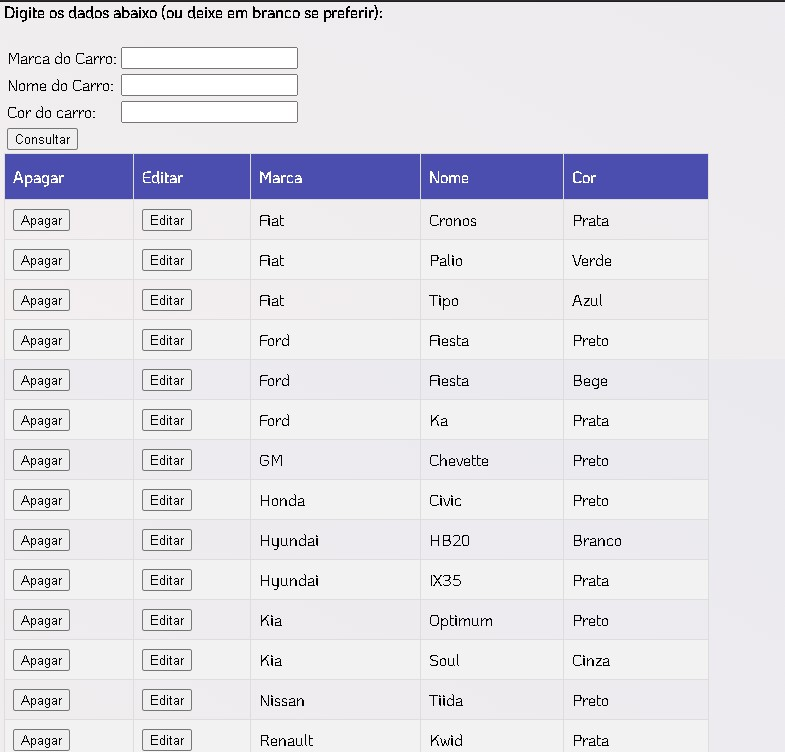
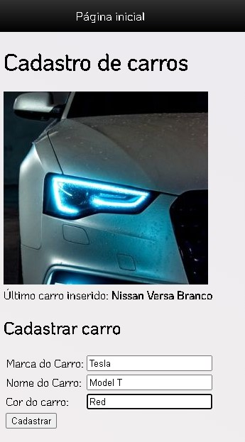

# Learning HTML server with Go and Fiber framework
----------

**With this code I learnt how to set up my Fiber Web Server to serve HTML files using Go HTML Template Engine**

----------
##### This web application simply implements a CRUD with MySql Database to manage Car "objects"

----------

 

